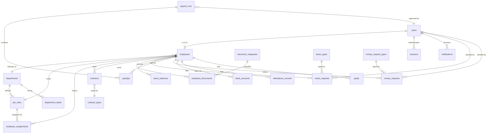

# GoldenHR — ERD & Backend Design

Derived from a full read of the frontend at commit `b008040`.
Source of truth: `goldenHR/app/page.tsx` (2105 lines), `app/layout.tsx`.

**Target database: MySQL 8.4** (decided over SQLite/Postgres). Verified on the VPS:
`mysql:8.4` runs under rootless Docker as `victor`, database `goldenhr_db` created,
write access confirmed. See §0 for engine-specific constraints.

---

## 0. MySQL 8.4 engine notes

The original design assumed Postgres. Three constructs changed for MySQL. Everything
else in this document is unchanged.

| Construct | Postgres original | MySQL 8.4 implementation |
|---|---|---|
| Payroll totals | `GENERATED ALWAYS AS … STORED` | **Same syntax works.** `gross_minor` / `net_minor` stay generated columns — the arithmetic is still enforced by the database. |
| Partial unique index | `UNIQUE (employee_id) WHERE is_current` | **Not supported** (no filtered indexes). `employee_assignments` gets a plain `UNIQUE (employee_id, is_current)`; "only one current assignment" is additionally enforced in `EmployeeAssignmentService` inside a transaction. Trade-off documented, not hidden. |
| Aggregate filter | `COUNT(*) FILTER (WHERE status='approved')` | **`SUM(CASE WHEN status='approved' THEN 1 ELSE 0 END)`** in report queries. |

| Feature | Status |
|---|---|
| `jsonb` | `settings.value` uses MySQL native `JSON`. |
| `DEFERRABLE` FK | Not supported by MySQL. The `users` ↔ `employees` cycle is resolved by persisting **one direction only**: `users.employee_id` (nullable). The reverse link is derived through `employees.user_id`, set by an application service after row creation. |
| Strict mode | Enabled by default in MySQL 8. Works with Laravel. |

Money is stored as `BIGINT` integer shillings in columns suffixed `_minor`.

## 1. Frontend architecture (what we're replacing)

Before designing the schema, the current data access has to be stated plainly.

| Concern | Current state |
|---|---|
| Entry point | `app/page.tsx` → `Page()` — the **only** route. `layout.tsx` wraps it. |
| Routing | **None.** No `app/` route segments, no `next/link`. Navigation is `const [active, setActive] = useState('Dashboard')` and a ternary chain at `page.tsx:2101`. |
| Data access | **None.** Every record is a module-level `const` array (`employeeRecords:117`, `departmentData:277`, `initialLeaveRequests:413`, `initialPayroll:517`, `seededContracts:785`, `initialDocuments:906`, `initialMoneyRequests:1042`, `reportData:1448`, `initialNotices:1290`). |
| Persistence | **None.** State is `useState` in memory. Refresh loses everything. |
| Cross-component state | Hand-rolled pub/sub: `noticeStore` + `noticeListeners` (`page.tsx:1303-1313`). |
| Auth | `const [authenticated, setAuthenticated] = useState(false)`. Login form calls `onLogin('HR')` regardless of credentials. Portal chosen by which button you click. |
| Server calls | **Zero** `fetch` / `axios` / `process.env` in the entire app. |

### Consequences for the backend

1. **All 13 nav items resolve to one URL.** Deep links and refresh don't work. This is a frontend refactor, not a backend one — but the API must be designed so the frontend *can* move to real routes.
2. **Entities are joined by display name, not ID.** Every record stores `employee: 'Amara Okafor'`. Departments store `lead: 'Noah Williams'` and `employees: ['Noah Williams', ...]`. Every foreign key must become a real `BIGINT` FK.
3. **Names are used as keys.** `key={person.email}` in the employee list — email is the de-facto identifier today.
4. **Two portals, one account model.** HR vs Employee is a portal toggle, not a role. Needs a real `role` on `users`.
5. **Money is pre-formatted strings.** `salary: 'TSh 4,860,000'`, and `salary.replace(/[^\d.]/g, '')` is used to parse it back. Must become integers (minor units).

---

## 2. Domain model

Modelled for **Tanzania** payroll: PAYE, NSSF pension, TIN, NIDA, TSh, bank transfer + mobile money settlement.

### 2.1 ER diagram



### 2.2 Table specifications

#### Identity & access

**`users`** — authentication, separate from the HR profile.
| Column | Type | Notes |
|---|---|---|
| id | BIGINT PK | |
| email | VARCHAR(255) UNIQUE | login identity |
| password_hash | VARCHAR(255) | bcrypt |
| role | ENUM | `hr_admin`, `hr_officer`, `employee` |
| employee_id | BIGINT FK → employees | NULL for pure HR admins |
| is_active | BOOLEAN | |
| last_login_at | TIMESTAMP | |
| created_at / updated_at | TIMESTAMPTZ | |

> `users` is split from `employees` deliberately. A department lead approves their own leave (`initialLeaveRequests[2]`: Sofia approves Liam, Jordan approves Sofia), and an HR admin may have no employee record — "Jordan Davis" appears as an approver but is not in `employeeRecords`.

#### Organisation

**`departments`**
`id` PK · `name` VARCHAR(120) UNIQUE · `description` TEXT · `is_active` BOOLEAN · timestamps

**`department_leads`**
`id` · `department_id` FK · `employee_id` FK · `is_primary` BOOLEAN · timestamps
> Resolves `departmentData[].lead`. Unique index on `(department_id)` where `is_primary`.

**`job_roles`**
`id` · `department_id` FK · `title` VARCHAR(150) · `level` ENUM(`lead`,`senior`,`mid`,`junior`,`intern`) · `is_active` · timestamps
> Replaces `departmentData[].roles` + `roleLevels`. UNIQUE `(department_id, title)`.
> **The level is a property of the role, not the person** — matches the UI, where a role row has one `Level` dropdown.

**`employee_assignments`**
`id` · `employee_id` FK · `job_role_id` FK · `department_id` FK · `is_current` BOOLEAN · `effective_from` DATE · `effective_to` DATE NULL · timestamps
> Models the role-assignment history that `N-105` ("Maya Patel moved from Frontend Engineer to Engineering Lead") implies. MySQL has no partial indexes, so "only one current assignment per employee" is enforced in `EmployeeAssignmentService` (see §0).

**`employees`**
| Column | Type | Source |
|---|---|---|
| id | BIGINT PK | |
| employee_code | VARCHAR(20) UNIQUE | `GH-0248` |
| user_id | BIGINT FK → users NULL | |
| first_name / last_name | VARCHAR(120) | split from `name` |
| email | VARCHAR(255) UNIQUE | |
| phone | VARCHAR(40) | `+255 712 448 201` |
| date_of_birth | DATE | `birth` |
| tin | VARCHAR(32) | `TIN-4482-9917` |
| nida_number | VARCHAR(64) | `19901234-...` |
| address | TEXT | |
| emergency_contact_name | VARCHAR(150) | |
| emergency_contact_phone | VARCHAR(40) | |
| department_id | BIGINT FK | |
| job_role_id | BIGINT FK | |
| employment_type | ENUM | `full_time`,`part_time`,`contract`,`temporary` |
| start_date | DATE | `start` |
| hire_date | DATE | `hire` |
| base_salary_minor | BIGINT | parsed from `'TSh 4,860,000'` |
| currency | CHAR(3) | `TZS` |
| profile_image_path | VARCHAR(500) NULL | |
| status | ENUM | `active`,`on_leave`,`suspended`,`terminated` |
| termination_date | DATE NULL | |

> `employment_type` and `base_salary` live on `employees` **and** `contracts`. That's intentional and matches the UI: the contract screen shows "VERIFIED EMPLOYEE DETAILS — Base salary" read-only from the employee, then lets HR override it per contract. Treat `employees.base_salary_minor` as current/authoritative and the contract as the legal record.

#### Documents

**`contracts`**
`id` · `reference` VARCHAR(32) UNIQUE (`GH-2024-018`) · `employee_id` FK · `contract_type_id` FK · `start_date` · `end_date` NULL · `duration_days` INT · `base_salary_minor` BIGINT · `description` TEXT · `termination_terms` TEXT · `status` ENUM(`draft`,`pending_signature`,`active`,`renewal_due`,`expired`,`terminated`) · `signed_at` TIMESTAMP NULL · `created_by` FK → users · timestamps

**`contract_types`** — `id` · `name` (`Full time employment`, `Fixed term contract`, `Part time employment`, `Probation contract`, `Consultancy agreement`)

> `duration_days = 0` means open-ended in the UI (`contractDurations`, page.tsx:766). Store as `NULL end_date` instead of a magic zero.

**`document_categories`** — `id` · `name` · `slug`
> Seed: Contract, Identity, Registration, Payroll, Leave, Training, Personal.

**`employee_documents`**
`id` · `reference` VARCHAR(32) (`DOC-001`) · `employee_id` FK · `contract_id` FK NULL · `category_id` FK · `name` VARCHAR(255) · `disk_path` VARCHAR(500) · `mime_type` · `size_bytes` BIGINT · `status` ENUM(`verified`,`pending_review`,`expiring_soon`) · `expires_at` DATE NULL · `uploaded_by` FK → users · timestamps
> `size_bytes` replaces the display string `'482 KB'` — format in the UI, not the DB.

#### Leave

**`leave_types`** — `id` · `name` · `is_paid` BOOLEAN · `annual_allowance_days` DECIMAL(5,2) NULL
> Seed from the request form (page.tsx:493): Annual, Sick, Personal, Medical, Parental.

**`leave_requests`**
`id` · `reference` VARCHAR(32) (`LV-2024-041`) · `employee_id` FK · `leave_type_id` FK · `start_date` · `end_date` · `days` DECIMAL(5,2) · `reason` TEXT · `coverage_employee_id` FK NULL · `approver_id` FK → users NULL · `status` ENUM(`pending`,`approved`,`declined`) · `reviewer_note` TEXT · `decided_at` TIMESTAMP NULL · timestamps

> **`coverage_employee_id` is a real FK.** The UI shows "Coverage during leave" and even branches on `coverage === approver` (page.tsx:450). A plain string can't express that.

**`leave_balances`**
`id` · `employee_id` FK · `leave_type_id` FK · `year` SMALLINT · `entitled_days` DECIMAL(5,2) · `used_days` DECIMAL(5,2) · `booked_days` DECIMAL(5,2) · timestamps · UNIQUE (`employee_id`,`leave_type_id`,`year`)
> Powers the leave-balance donut (page.tsx:1904): remaining = entitled − used − booked.

> **Leave allowance is inconsistent in the mock data** — 18 days in the approval screen and the request form (page.tsx:449, 497), 21 days in the employee work-progress donut (page.tsx:1896, 1904). `entitled_days` per type resolves this; don't hardcode.

#### Payroll

**`payroll_runs`** — `id` · `period_year` SMALLINT · `period_month` TINYINT · `status` ENUM(`draft`,`pending_approval`,`approved`,`paid`) · `approved_by` FK → users NULL · `approved_at` · `paid_at` · totals (cached) · timestamps · UNIQUE (`period_year`,`period_month`)

**`payslips`**
`id` · `reference` VARCHAR(32) (`PR-2024-062`) · `run_id` FK · `employee_id` FK · period · `basic_minor` BIGINT · `overtime_minor` BIGINT · `bonus_minor` BIGINT · `allowance_minor` BIGINT · `gross_minor` BIGINT (generated) · `tax_minor` BIGINT (PAYE) · `pension_minor` BIGINT (NSSF) · `other_deduction_minor` BIGINT · `total_deductions_minor` (generated) · `net_minor` BIGINT (generated) · `payment_method` ENUM(`bank_transfer`,`mobile_money`) · `status` ENUM(`paid`,`approved`,`pending_approval`) · `paid_at` DATE NULL · timestamps · UNIQUE (`run_id`,`employee_id`)

> Mirrors `buildGross()` (page.tsx:513) exactly: `gross = basic + overtime + bonus + allowance`; `net = gross − (tax + pension + other)`. Store these as **generated columns** so the arithmetic can never drift.
> Money in **integer minor units** (TSh has no subunit in circulation; store whole shillings and treat the column as `_minor` for provider-agnosticism).

**`payslip_deductions`** — `id` · `payslip_id` FK · `code` (`PAYE`,`NSSF`,`OTHER`) · `label` · `amount_minor` BIGINT
> Optional normalised alternative to the three columns. Prefer the columns for v1 (matches the fixed 3-item UI), extract to a table if deduction types become configurable.

#### Money requests

**`money_request_types`** — `id` · `name` · `requires_receipt` BOOLEAN
> Seed from `moneyKinds` (page.tsx:1039): Salary advance, Expense reimbursement, Emergency advance, Travel allowance, Medical claim.

**`money_requests`**
`id` · `reference` VARCHAR(32) (`MR-2024-118`) · `employee_id` FK · `type_id` FK · `amount_minor` BIGINT · `reason` TEXT · `needed_by` DATE · `payment_method` ENUM · `status` ENUM(`pending`,`approved`,`paid`,`declined`) · `decided_by` FK → users NULL · `decided_at` NULL · `decision_note` TEXT · `receipt_number` VARCHAR(32) (`RCP-2024-0918`) · timestamps

> `advanceLimit = 2_500_000` (page.tsx:1040) is a **config value**, not a column — put it in `settings` or env, and enforce server-side.

#### Banking & attendance

**`bank_accounts`** — `id` · `employee_id` FK · `type` ENUM(`bank`,`mobile_money`) · `bank_name` · `account_number` · `account_name` · `is_primary` BOOLEAN · `is_verified` BOOLEAN · `verified_at` · timestamps

**`attendance_records`** — `id` · `employee_id` FK · `work_date` DATE · `status` ENUM(`worked`,`leave`,`absent`,`holiday`,`weekend`) · `worked_hours` DECIMAL(4,2) · UNIQUE (`employee_id`,`work_date`)
> Required by the Work progress page (`workedDays`/`leaveDays` arrays, page.tsx:1862). Not yet a first-class entity in the mock — currently hardcoded per-employee.

**`goals`** — `id` · `employee_id` FK · `title` · `period_year` · `progress_percent` DECIMAL(5,2) · `due_date` · `status` ENUM

#### Notifications & settings

**`notifications`** — Laravel's own database-notification table, extended: `id` UUID PK · `type` · `notifiable_type`/`notifiable_id` · `data` JSON · `read_at` NULL · `actor_user_id` FK · `subject_type`/`subject_id` (polymorphic link to leave_request, contract, etc.) · timestamps

> **Revised during Phase 4.** The original design had a separate `notifications` + `notification_recipients` pair. That name collides with the framework's own table, which already backs the database channel — two tables of one name is not viable. Reusing Laravel's removes the need for `notification_recipients` entirely, because `read_at` is already per recipient, which is exactly the semantics the unread badge needs (`page.tsx:2094` counts `!read` per viewer). The domain `kind` (the 9 `NoticeKind` values, page.tsx:1272), title and body live inside `data`.

**`settings`** — `id` · `key` UNIQUE · `value` JSON · `updated_by` FK
> `advance_limit`, `default_annual_leave_days`, `currency`, `payroll_day`.

---

## 3. Referential integrity notes

| Rule | Reason |
|---|---|
| `employees.department_id` + `job_role_id` RESTRICT | Can't delete a department with people. Soft-delete via `is_active`. |
| `job_roles.department_id` CASCADE | Roles die with their department. |
| `payslips.run_id` RESTRICT, UNIQUE (`run_id`,`employee_id`) | One payslip per employee per run; runs are financial records, never deleted. |
| `leave_requests.approver_id` SET NULL | Preserves history if an approver leaves. |
| `money_requests.employee_id` RESTRICT | Financial audit trail. |
| All `created_by`/`decided_by`/`uploaded_by` SET NULL | Don't cascade-delete financial history on user deletion. |

**Circular FK:** `employees.user_id` ↔ `users.employee_id`. MySQL has no `DEFERRABLE` constraint, so only **one direction is persisted**: `users.employee_id` (nullable). `employees.user_id` is set by `UserService` immediately after the employee row is created, inside the same transaction.

---

## 4. Migration from current state to schema

### 4.1 Seeding order

```
1. document_categories, contract_types, leave_types, money_request_types
2. departments
3. users            (HR admins, no employee record)
4. employees        (dept + role null initially)
5. job_roles        (per department)
6. employee_assignments, department_leads   (backfill)
7. employees.department_id / job_role_id    (second pass)
8. bank_accounts
9. contracts, employee_documents
10. leave_balances, leave_requests
11. payroll_runs, payslips
12. money_requests
13. attendance_records, goals
14. notifications
```

### 4.2 Mock → column mapping

| Mock constant | Line | Target |
|---|---|---|
| `employeeRecords` | 117 | `employees` |
| `departmentData[].lead` | 277 | `department_leads` |
| `departmentData[].roles` + `roleLevels` | 277, 299 | `job_roles.title` + `.level` |
| `departmentData[].employees` | 277 | `employee_assignments` |
| `seededContracts` | 785 | `contracts` |
| `initialDocuments` | 906 | `employee_documents` |
| `initialLeaveRequests` | 413 | `leave_requests` |
| `profileLeave` | 130 | `leave_requests` |
| `initialPayroll` | 517 | `payslips` + `payroll_runs` |
| `profilePayslips` | 136 | `payslips` |
| `initialMoneyRequests` | 1042 | `money_requests` |
| `employeeDocuments` | 1164 | `employee_documents` |
| `initialNotices` | 1290 | `notifications` |
| `reportData` | 1448 | **not persisted** — derive via aggregates |
| `workedDays`/`goalProgress` | 1862, 1866 | `attendance_records` / `goals` |

**Parsing rules:**
- `salary: 'TSh 4,860,000'` → `4860000`
- `hire: 'May 12, 2023'` → `2023-05-12`
- `submitted: '2 hours ago'` → `submitted_at` timestamp
- `size: '482 KB'` → `size_bytes = 483328`
- `added: 'May 12, 2023'` → `created_at`

### 4.3 `reportData` must be derived, not stored

The Reports page (`reportData`, page.tsx:1448) carries 22 columns per month: payrollGross/Net, allowances, deductions, paye, pension, requested/approved/rejected, contracts, renewals, headcount, docsAdded, employeesAdded, rolesAdded, departmentsAdded, leaveApproved/Declined.

**Every field is an aggregate** over the tables above:

```sql
-- June payroll totals
SELECT SUM(gross_minor) AS payroll_gross, SUM(net_minor) AS payroll_net,
       SUM(allowance_minor) AS allowances,
       SUM(tax_minor + pension_minor + other_deduction_minor) AS deductions,
       SUM(tax_minor) AS paye, SUM(pension_minor) AS pension
FROM payslips WHERE period_year = 2024 AND period_month = 6;

-- Headcount (must be point-in-time, not a live COUNT)
SELECT COUNT(*) AS headcount FROM employees
WHERE hire_date <= '2024-06-30'
  AND (termination_date IS NULL OR termination_date > '2024-06-30')
  AND status <> 'terminated';

-- Leave decisions (MySQL: no FILTER clause — use SUM(CASE WHEN …))
SELECT
  SUM(CASE WHEN status = 'approved' THEN 1 ELSE 0 END) AS leave_approved,
  SUM(CASE WHEN status = 'declined'  THEN 1 ELSE 0 END) AS leave_declined
FROM leave_requests
WHERE MONTH(submitted_at) = 6 AND YEAR(submitted_at) = 2024;
```

All report aggregates above are MySQL 8.4 compatible. Headcount is deliberately computed
**point-in-time** against the period end date rather than a live `COUNT(*)`, so a June
report keeps showing June's headcount after July hires.

---

## 5. API surface

### Auth
```
POST   /api/auth/login              → {token, user}
POST   /api/auth/logout
GET    /api/auth/me
PUT    /api/auth/password
```

### HR portal
```
GET    /api/departments             ?include=roles,lead,headcount
POST   /api/departments
GET    /api/departments/{id}
PATCH  /api/departments/{id}
POST   /api/departments/{id}/lead
GET    /api/departments/{id}/roles
POST   /api/departments/{id}/roles          (bulk-accepts newline/comma list)
DELETE /api/roles/{id}

GET    /api/employees               ?search=&department_id=&status=&employment_type=
POST   /api/employees
GET    /api/employees/{id}
PATCH  /api/employees/{id}
DELETE /api/employees/{id}                  (soft)
POST   /api/employees/{id}/role             (creates assignment, closes previous)
PUT    /api/employees/{id}/password         (reset portal login)
GET    /api/employees/{id}/documents
POST   /api/employees/{id}/documents        (multipart)
DELETE /api/documents/{id}

GET    /api/leave-requests           ?status=&employee_id=
POST   /api/leave-requests
GET    /api/leave-requests/{id}
POST   /api/leave-requests/{id}/approve
POST   /api/leave-requests/{id}/decline
GET    /api/leave-balances/me

GET    /api/payroll/runs             ?year=&month=
POST   /api/payroll/runs
GET    /api/payroll/runs/{id}
POST   /api/payroll/runs/{id}/approve
POST   /api/payroll/runs/{id}/pay
GET    /api/payslips                 ?employee_id=&year=
GET    /api/payslips/{id}/pdf

GET    /api/contracts                ?status=
POST   /api/contracts
GET    /api/contracts/{id}
POST   /api/contracts/{id}/send-for-signature
POST   /api/contracts/{id}/renew

GET    /api/money-requests           ?status=
POST   /api/money-requests
POST   /api/money-requests/{id}/approve|decline|mark-paid
GET    /api/money-requests/{id}/receipt

GET    /api/reports/monthly          ?year=2024
GET    /api/dashboard
GET    /api/notifications            ?unread=
POST   /api/notifications/{id}/read
POST   /api/notifications/read-all
```

### Employee portal (scoped by the auth token, not a param)
```
GET    /api/me/payslips
GET    /api/me/contract
GET    /api/me/registration
PATCH  /api/me/registration          (salary + department are read-only — UI shows "Managed by People Operations")
GET    /api/me/work-progress         ?year=
POST  /api/me/leave-requests
POST   /api/me/money-requests
GET    /api/me/documents
```

---

## 6. Decisions

**Resolved:**
1. ~~Postgres vs SQLite~~ → **MySQL 8.4** on the VPS, confirmed working under rootless Docker. Engine-specific changes in §0.
2. ~~Circular FK~~ → persist `users.employee_id` only (§3).

**Still open:**
3. **Roles & permissions.** The UI has a hardcoded `role` enum on users. A real permission matrix (who may approve leave above N days, who may see payroll) is not implied anywhere in the frontend.
4. **Attendance source.** `workedDays` is currently per-employee hardcoded. Is there a real source (biometric device, timesheet UI), or should it stay manual?
5. **Leave allowance** — 18 or 21 days? Store per `leave_types` row; confirm the correct default.
6. **`reportData` is demo-scale** (headcount 212→272) but `employeeRecords` has 4 people. Seeding reports from 4 employees will not reproduce those charts — decide whether the demo aggregates are kept as fixtures.
7. **PDF export approach** — server-rendered or client-side (gates Phase 6).
8. **Employee image visibility** — all staff, or HR-only?
